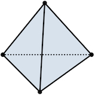

# CW Networks


This repository contains the code used for the papers
[Weisfeiler and Lehman Go Cellular: CW Networks](https://arxiv.org/abs/2106.12575) (Under review)
and [Weisfeiler and Lehman Go Topological: Message Passing Simplicial Networks](https://arxiv.org/abs/2103.03212) (ICML 2021)

&nbsp;&nbsp;&nbsp;&nbsp;  &nbsp;&nbsp;  

## Installation

We use `Python 3.8` and `PyTorch 1.7.0` on `CUDA 10.2` for this project.
Please open a terminal window and follow these steps to prepare the virtual environment needed to run any experiment.

Create the environment:
```shell
conda create --name cwn python=3.8
conda activate cwn
```

Install torch:
```shell
conda install -y pytorch=1.7.0 torchvision cudatoolkit=10.2 -c pytorch
```

Install torch-geometric:
```shell
sh pyG_install.sh cu102
```

Install other required packages via pip:
```shell
pip install -r requirements.txt
```

Install graph-tool via conda:
```shell
sh graph-tool_install.sh
```

At this point you should be good to go. Always activate the environment before running the commands listed below.

## Testing

We suggest running all tests in the repository to verify everything is in place. Run:
```shell
pytest .
```
All tests should pass (typically showed in green).

## Experiments on molecular benchmarks

To run an experiment on a molecular benchmark with a CWN, execute:
```shell
sh exp/scripts/cwn-<benchmark>.sh
```
with `<benchmark>` one amongst `zinc`, `zinc-full`, `molhiv`.

The results will be written under `exp/results/<BENCHMARK>-cwn-<benchmark>/`.

_Note_: before the training starts, the script will download the corresponding graph datasets and perform the appropriate ring-lifting procedure.

Imposing the parameter budget: it is sufficient to add the suffix `-small` to the `<benchmark>` placeholder:
```shell
sh exp/scripts/cwn-<benchmark>-small.sh
```
For example, `sh exp/scripts/cwn-zinc-small.sh` will run the training on ZINC with parameter budget.

## Experiments on SR families

To run an experiment on the SR benchmark with a CWN, run:
```shell
sh exp/scripts/cwn-sr.sh <k>
```
replacing `<k>` with a value amongst `4`, `5`, `6` (`<k>` is the maximum ring size employed in the lifting procedure). The results, for each family, will be written under `exp/results/SR-cwn-sr-<k>/`.

_Note_: before the inference starts, the script will perform the appropriate ring-lifting procedure on the SR graphs in the family.

The following command will run the MLP-sum (strong) baseline on the same ring-lifted graphs (results under `exp/results/SR-cwn-base-sr-<k>/`):
```shell
sh exp/scripts/cwn-sr-base.sh <k>
```

In order to run these experiment with clique-lifting (MPSNs), run (results under `exp/results/SR-mpsn-sr/`):
```shell
sh exp/scripts/mpsn-sr.sh
```

_Note_: Clique-lifting is applied up to dimension `k-1`, with `k` the maximum clique-size in the family.

The MLP-sum baseline on clique-complexes is run with (results under `exp/results/SR-mpsn-base-sr/`):
```shell
sh exp/scripts/mpsn-sr-base.sh
```

## MPSN Orientation Experiments

For the Ocean Dataset experiments, the data must be downloaded from [here](https://github.com/nglaze00/SCoNe_GCN/blob/master/ocean_drifters_data/dataBuoys.jld2).
The file must be placed in `datasets/OCEAN/raw/`. 

For running the experiments use the following scripts:
```shell
sh ./exp/scripts/mpsn-flow.sh [id/relu/tanh]
sh ./exp/scripts/mpsn-ocean.sh [id/relu/tanh]
sh ./exp/scripts/gnn-inv-flow.sh
sh ./exp/scripts/gnn-inv-ocean.sh
```

### Credits

For attribution in academic contexts, please cite the following papers

```
@InProceedings{pmlr-v139-bodnar21a,
  title = 	 {Weisfeiler and Lehman Go Topological: Message Passing Simplicial Networks},
  author =       {Bodnar, Cristian and Frasca, Fabrizio and Wang, Yuguang and Otter, Nina and Montufar, Guido F and Li{\'o}, Pietro and Bronstein, Michael},
  booktitle = 	 {Proceedings of the 38th International Conference on Machine Learning},
  pages = 	 {1026--1037},
  year = 	 {2021},
  editor = 	 {Meila, Marina and Zhang, Tong},
  volume = 	 {139},
  series = 	 {Proceedings of Machine Learning Research},
  month = 	 {18--24 Jul},
  publisher =    {PMLR},
}
```

```
@article{bodnar2021b,
  title={Weisfeiler and Lehman Go Cellular: CW Networks},
  author={Bodnar, Cristian and Frasca, Fabrizio and Otter, Nina and Wang, Yu Guang and Li{\`o}, Pietro and Mont{\'u}far, Guido and Bronstein, Michael},
  journal={arXiv preprint arXiv:2106.12575},
  year={2021}
}
```

## TODOs

- [ ] Add support for coboundary adjacencies. 
- [ ] Refactor the way empty cochains are handled for batching.
- [ ] Remove redundant parameters from the models 
  (e.g. msg_up_nn in the top dimension.)   
- [ ] Address other TODOs left in the code. 
