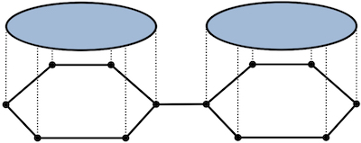
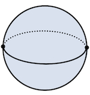

# CW Networks


This repository contains the code used for the papers
[Weisfeiler and Lehman Go Cellular: CW Networks](https://arxiv.org/abs/2106.12575) (Under review)
and [Weisfeiler and Lehman Go Topological: Message Passing Simplicial Networks](https://arxiv.org/abs/2103.03212) (ICML 2021)

&nbsp;&nbsp;&nbsp;&nbsp;  &nbsp;&nbsp;  

## Installation

We use `Python 3.8` and `PyTorch 1.7.0` on `CUDA 10.2` for this project.
Please open a terminal window and follow these steps to prepare the virtual environment needed to run any experiment.

Create the environment:
```
conda create --name cwn python=3.8
conda activate cwn
```

Install torch:
```
conda install -y pytorch=1.7.0 torchvision cudatoolkit=10.2 -c pytorch
```

Install torch-geometric:
```
sh pyG_install.sh cu102
```

Install other required packages via pip:
```
pip install -r requirements.txt
```

Install graph-tool via conda:
```
sh graph-tool_install.sh
```

At this point you should be good to go. Please remind to always activate the environment before running any of the commads listed in the following.

## Testing

We provide a series of Python unit tests that can be conveniently run by `pytest`.
We suggest running all tests in the repository after installation to verify everything is in place. Simply run:
```
pytest .
```
This command will recursively fetch all unit tests present in the repository and run them. A summary will be printed out in the end. All tests should pass (typically showed in green).

## Experiments on molecular benchmarks with CWNs

### Unconstrained models

In order to run an experiment on a molecular benchmark simply execute:
```
sh exp/scripts/cwn-<benchmark>.sh
```
where `<benchmark>` with one amongst `zinc`, `zinc-full`, `molhiv`.

These shell scripts will run the `exp/run_mol_exp.py` script passing the required parameters for each experiment.

Internally, for a specified range of random seeds, the script will run the trainings sequentially, compute final performance statistics and print them on screen in the end. Additionally, the script will write these results under `exp/results/<BENCHMARK>-cwn-<benchmark>/`.

_Note_: before the training starts, the script will download the corresponding graph datasets and perform the appropriate ring-lifting procedure.

### Imposing the parameter budget

Imposing the parameter budget: in order to run the 'smaller' `CIN` counterparts on these benchmarks, it is sufficient to add the suffix `-small` to the `<benchmark>` placeholder.
```
sh exp/scripts/cwn-<benchmark>-small.sh`
```
For example, `sh exp/scripts/cwn-zinc-small.sh` will run the training on ZINC with parameter budget.

## Experiments on SR families with (untrained) CWNs

In order to run an experiment on the SR benchmark with a CWN, run the following:
```
sh exp/scripts/cwn-sr.sh <k>
```
replacing `<k>` with the a value amongst `4`, `5`, `6` (this corresponds to the maximum ring size employed in the lifting procedure).
The shell script will internally run the `exp/run_sr_exp.py` script, passing the required parameters. The script will instantiate and run a CIN model on all the SR families, repeating each experiment with 5 different random seeds. It will then print on screen the failure rate statistics on every family, and also dump this result on file, under `exp/results/SR-cwn-sr-<k>/`.

_Note_: before the inference starts, the script will perform the appropriate ring-lifting procedure on the SR graphs in the family.

Finally, the following command will run the MLP-sum (strong) baseline described in the paper:
```
sh exp/scripts/cwn-sr-base.sh <k>
```
Results will be written under `exp/results/SR-cwn-base-sr-<k>/`.

## Experiments on SR families with (untrained) MPSNs

In order to run an experiment on the SR benchmark with a MPSN, run the following:
```
sh exp/scripts/mpsn-sr.sh
```
The shell script will internally run the `exp/run_sr_exp.py` script, passing the required parameters. The script will instantiate and run a SIN model on all the SR families, repeating each experiment with 10 different random seeds. It will then print on screen the failure rate statistics on every family, and also dump this result on file, under `exp/results/SR-mpsn-sr/`.

_Note_: before the inference starts, the script will perform the appropriate clique-lifting procedure on the SR graphs in the family, up to dimension `k-1`, with `k` the maximum clique-size in the family.

Finally, the following command will run the MLP-sum (strong) baseline described in the paper:
```
sh exp/scripts/mpsn-sr-base.sh
```
Results will be written under `exp/results/SR-mpsn-base-sr/`.

### Credits

For attribution in academic contexts, please cite the following papers

```
@InProceedings{pmlr-v139-bodnar21a,
  title = 	 {Weisfeiler and Lehman Go Topological: Message Passing Simplicial Networks},
  author =       {Bodnar, Cristian and Frasca, Fabrizio and Wang, Yuguang and Otter, Nina and Montufar, Guido F and Li{\'o}, Pietro and Bronstein, Michael},
  booktitle = 	 {Proceedings of the 38th International Conference on Machine Learning},
  pages = 	 {1026--1037},
  year = 	 {2021},
  editor = 	 {Meila, Marina and Zhang, Tong},
  volume = 	 {139},
  series = 	 {Proceedings of Machine Learning Research},
  month = 	 {18--24 Jul},
  publisher =    {PMLR},
}
```

```
@article{bodnar2021b,
  title={Weisfeiler and Lehman Go Cellular: CW Networks},
  author={Bodnar, Cristian and Frasca, Fabrizio and Otter, Nina and Wang, Yu Guang and Li{\`o}, Pietro and Mont{\'u}far, Guido and Bronstein, Michael},
  journal={arXiv preprint arXiv:2106.12575},
  year={2021}
}
```

### Known issues

- Coboundary adjacencies are not supported
